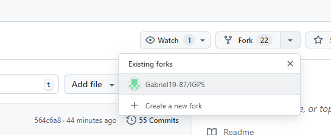
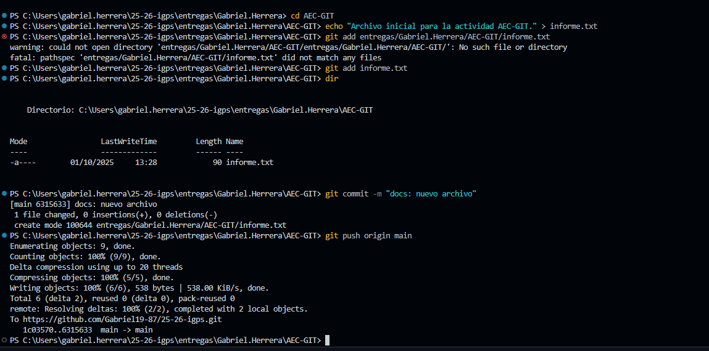
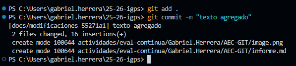
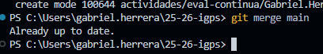
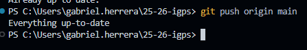
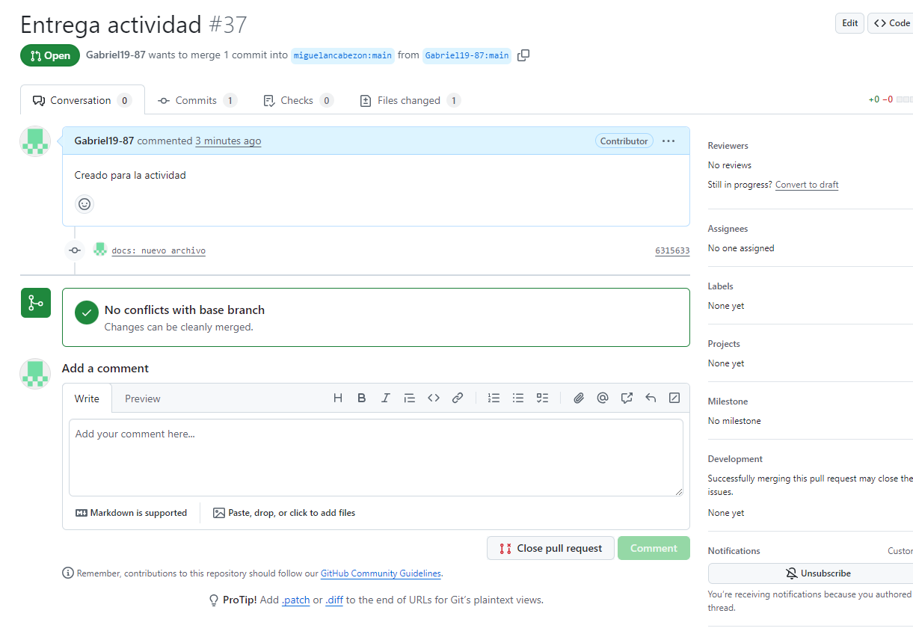

# Actividad AEC-GIT

## Paso 1: Fork y clonación
He realizado un fork del repositorio original y lo he clonado en mi ordenador.

## Paso 2: Creación de carpetas
He creado la carpeta con mi nombre y dentro la carpeta AEC-GIT.

## Paso 3: Primer commit
Creé el archivo informe.txt, lo añadí y lo subí al repositorio remoto.

## Paso 4: Combinar ramas
He creado una nueva rama llamada `docs/modificaciones` y modifiqué el archivo `informe.txt` para añadir capturas y descripciones

## Paso 5: Pull Request
He realizado varios commits (entre 2 y 5) añadiendo las capturas y descripciones de cada paso

## Paso 6: Merge de ramas
He vuelto a la rama principal y he combinado los cambios de la rama `docs/modificaciones`.

## Paso 7: Pull Request
Finalmente, he creado una Pull Request desde mi fork hacia el repositorio original del profesor, incluyendo este archivo con todas las capturas y descripciones.

