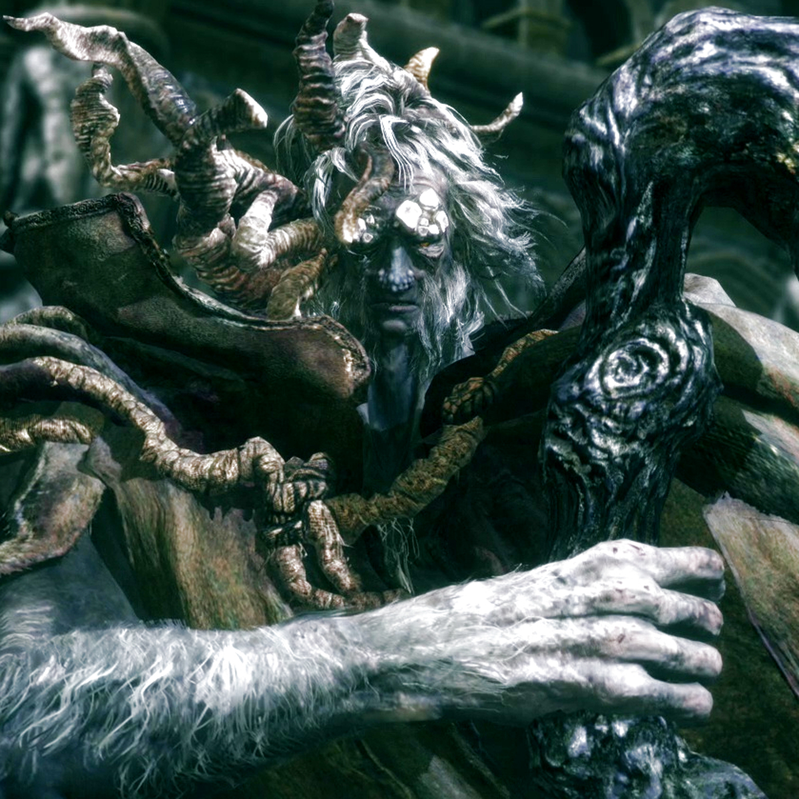

# Jefes principales: estrategias y patrones ⚔️

[← Volver al Inicio](../../index.md)

> **Información del artículo**  
> Fecha de creación: 26/10/2025  
> Última actualización: 26/10/2025  
> Tiempo estimado de lectura: 15 minutos  
> Etiquetas: #jefes #estrategias #eldenring #combate

## Tabla de Contenidos
- [Introducción](#introducción)
- [Jefes del comienzo](#jefes-del-comienzo)
- [Jefes intermedios](#jefes-intermedios)
- [Estrategias de combate](#estrategias-de-combate)
- [Consejos avanzados](#consejos-avanzados)
- [Conclusión](#conclusión)

## Introducción

Este artículo analiza a los jefes principales de Elden Ring, describiendo sus patrones de ataque, debilidades y estrategias recomendadas. 

> 📌 **Nota**: Para información sobre builds, consulta la [Guía de inicio](guia-inicio-builds.md) y el [glosario](glosario.md).

## Jefes del comienzo

### Margit, el Augurio Caído

| Aspecto | Estrategia | Recomendación |
|---------|------------|---------------|
| Ataque de espada | Esquiva lateral | Mantener distancia |
| Magia de área | Bloqueo con escudo | Usar momentos de recarga |
| Patrones combinados | Observación | Aprender timing |

### Godrick, el Injertado
- **Comportamiento**: Ataques físicos masivos, combinados con hechizos
- **Estrategia**: Esquivar, contraataque en combo con invocaciones
- **Dificultad**: ★★★☆☆

### Red Wolf, diablillo de la Llanura
- **Movimientos**: Rápido, combos de mordida y embestida
- **Estrategia**: Paciencia, bloquear ataques y atacar tras esquiva
- **Dificultad**: ★★☆☆☆

## Jefes intermedios

### Rennala, Reina de la Luna Llena
- **Fase 1**: Romper escudos mágicos
- **Fase 2**: Mantener distancia y aprovechar ventanas de ataque
- **Consejo**: Usar armas con daño físico alto

### Starscourge Radahn
1. Iniciar el combate a distancia
2. Invocar aliados disponibles repetidamente
3. Aprovechar la distracción para ataques seguros
4. Mantener distancia durante sus ataques masivos
5. Usar Torrentera para movilidad

### Maliketh, el Negro Cuchillo
- **Patrón**: Ataques rápidos y agresivos
- **Estrategia**: Esquiva continua y ataques segmentados
- **Consumibles**: Usar potenciadores de resistencia

## Estrategias de combate

### Patrones de ataque
1. Identificar animaciones clave
2. Priorizar ataques más peligrosos
3. Memorizar secuencias comunes

### Uso de invocaciones
- Invocar aliados NPC o cooperativos
- Distribuir la atención del jefe
- Aprovechar ventanas de ataque seguras

### Gestión de recursos durante combate
- Mantener reserva de Estus
- Gestionar stamina eficientemente
- Usar objetos de curación en momentos seguros

## Consejos avanzados

### Combos y cancelaciones
- Aprovechar animaciones para encadenar ataques
- Cancelar ataques innecesarios para mejorar movilidad
- Practicar timings de combo específicos

### Resistencia y esquiva
- Mantener stamina para esquivar o bloquear
- Planificar escape tras ataque enemigo
- No agotar la barra de resistencia completamente

### Builds recomendadas
| Tipo de Build | Ideal contra | Ventajas |
|---------------|--------------|-----------|
| Fuerza | Jefes físicos | Alto daño por golpe |
| Magia | Jefes con escudo | Ataque a distancia |
| Híbrida | Varios tipos | Adaptabilidad |

## Conclusión

Dominar a los jefes requiere paciencia, observación y builds adecuadas. Se recomienda estudiar sus patrones y practicar combinaciones de ataque y defensa.

> 💬 **Cita**: "Cada jefe es un maestro; aprende sus lecciones y progresarás." — Guía del Tarnished.

## Enlaces relacionados
- [Guía de inicio y builds](guia-inicio-builds.md)
- [Lore y cronología](lore-cronologia.md)
- [Magia y objetos](magia-objetos.md)
- [Glosario](glosario.md)
- [Referencias bibliográficas](referencias.md)

---

[↑ Volver arriba](#jefes-principales-estrategias-y-patrones-)