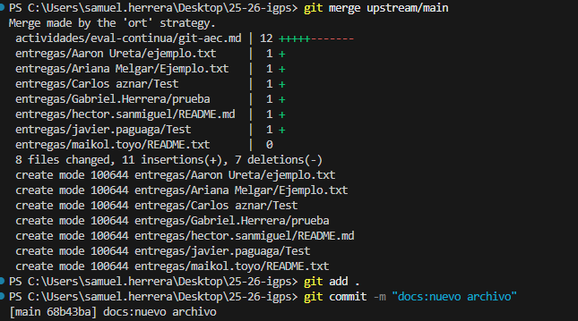
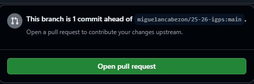

# Actividad: Uso de Fork, Branches y Pull Request en GitHub

Este documento describe el proceso seguido para realizar la actividad de Git.

---

## 📌 Pasos realizados

### 1. Hacer fork del repositorio del profesor
Se realizó un fork desde la interfaz de GitHub al repositorio original del profesor.  

**Captura:**  

---

### 2. Clonar el repositorio en local
Se clonó el repositorio en mi ordenador a partir del fork realizado.  
---

### 3. Crear estructura de carpetas
Se creó la carpeta con el formato `nombre.apellido/AEC-GIT/` y dentro de ella un archivo de texto inicial.  
Ese archivo se añadió al repositorio y se hizo un commit con el mensaje:  
> **docs: nuevo archivo**

**Captura:**  

---

### 4. Crear nueva rama y modificar archivo
Se creó la rama llamada `docs/modificaciones`.  
En esa rama se añadieron las capturas y una descripción de los pasos seguidos.  
Se realizaron entre **2 y 5 commits** con mensajes descriptivos.  

**Captura:**  

---

### 5. Combinar ramas
Se realizó la combinación de la rama `docs/modificaciones` con la rama `main`.  
---

### 6. Crear Pull Request
Finalmente, se creó una **Pull Request** hacia el repositorio original del profesor.  

**Captura:**  

---

## ✅ Conclusión
La actividad permitió practicar el flujo completo de trabajo con **Git y GitHub**:  
- Fork → Clonado → Estructura de carpetas → Creación de ramas → Commits → Merge → Pull Request.  

Este proceso refleja cómo colaborar de forma ordenada en un proyecto con control de versiones.
