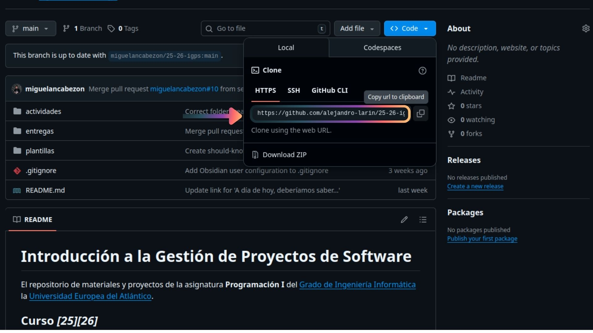
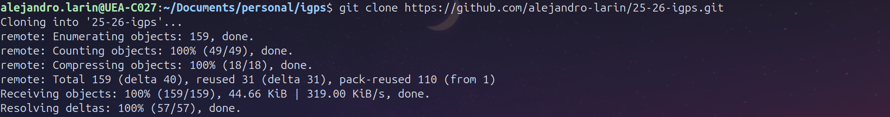
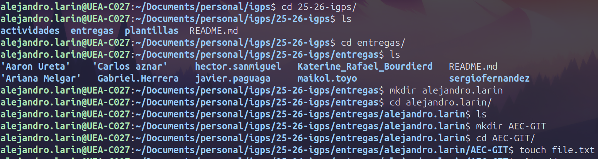
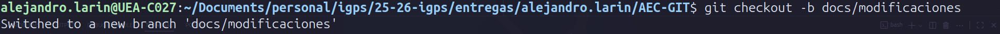
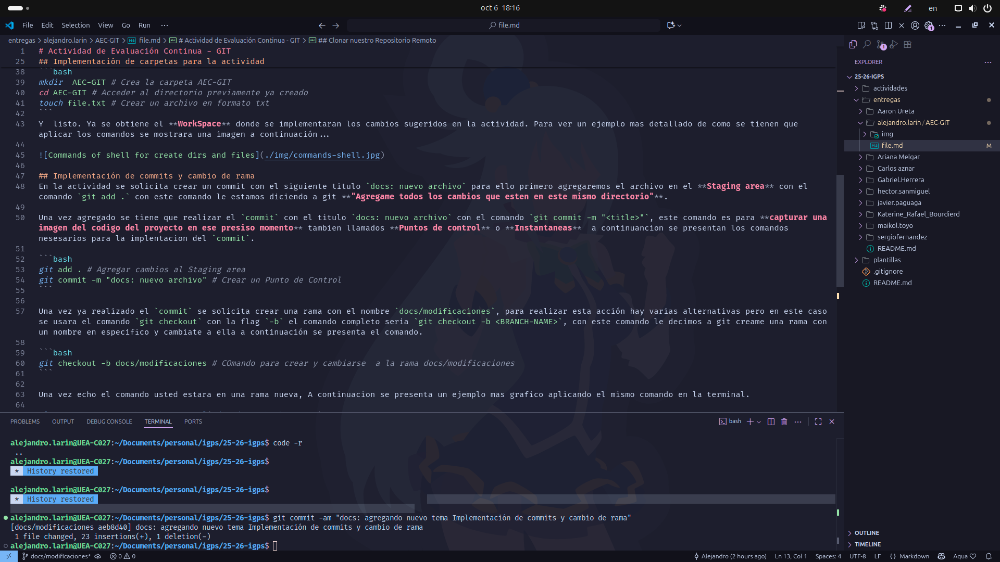
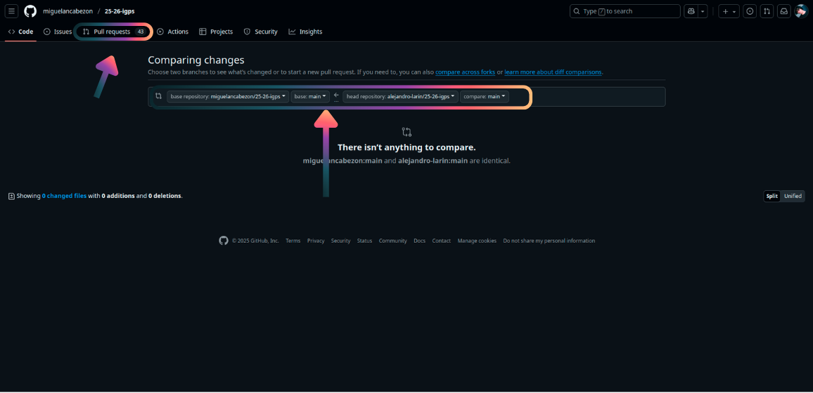

# Actividad de Evaluación Continua - GIT

## Índice

- [Hacer Fork del repositorio](#hacer-fork-del-repositorio)
- [Clonar nuestro Repositorio Remoto](#clonar-nuestro-repositorio-remoto)
- [Implementación de carpetas para la actividad](#implementación-de-carpetas-para-la-actividad)
- [Implementación de commits y cambio de rama](#implementación-de-commits-y-cambio-de-rama)
- [Implementacion de la documentacion](#implementacion-de-la-documentacion)
- [Implementacion del Merge y Pull Reques](#implementacion-del-merge-y-pull-reques)

## Hacer Fork del repositorio
Para hacer el **Fork** del repositorio, se debe acceder al [Repositorio oficial de IGPS](https://github.com/miguelancabezon/25-26-igps) y hacer un fork del repositorio. Para ello es necesario hacer clic en el botón que se muestra a continuación.


Una vez hecho el **Fork** en nuestro repositorio, pasamos al siguiente paso...

## Clonar nuestro Repositorio Remoto
En este caso, para clonar el repositorio se utilizará el protocolo `HTTPS`. Para conseguir la `URL` de nuestro repositorio remoto de **GitHub**, tienes que entrar al repositorio donde se realizó el fork y copiar la `URL`. A continuación se presenta una imagen de ejemplo de cómo obtener la `URL` de nuestro repositorio.



Una vez se obtenga la `URL`, en la terminal del dispositivo **Local** es necesario escribir el siguiente **comando** `git clone <URL>`. A continuación se presenta un ejemplo de cómo se debe aplicar el **comando**.

```bash
git clone https://github.com/alejandro-larin/25-26-igps.git # Comando para clonar el repositorio remoto.
```
A continuación se presenta una imagen de un ejemplo más gráfico en la **terminal**...



Una vez clonado nuestro repositorio, se creará una nueva carpeta con nuestro **Repositorio local** inicializado.

## Implementación de carpetas para la actividad
Para la actividad se solicita la creación de 2 carpetas y un archivo de tipo texto. A continuación se presentarán los respectivos comandos necesarios para crear los ficheros y archivos solicitados.

Primero hay que acceder al directorio de entregas y crear nuestra **carpeta** con el formato `nombre.apellido`. A continuación se comparten los comandos:

```bash
cd entregas # Acceder a un directorio
mkdir  nombre.apellido # Crear un directorio
cd nombre.apellido # Acceder al directorio previamente ya creado
```

Una vez creada nuestra carpeta `nombre.apellido`, se solicita crear una nueva carpeta con el nombre `AEC-GIT` que contenga un archivo `.txt`. A continuación se presentan los respectivos comandos.

```bash
mkdir  AEC-GIT # Crea la carpeta AEC-GIT
cd AEC-GIT # Acceder al directorio previamente ya creado
touch file.txt # Crear un archivo en formato txt
```
Y listo. Ya se obtiene el **WorkSpace** donde se implementarán los cambios sugeridos en la actividad. Para ver un ejemplo más detallado de cómo se tienen que aplicar los comandos, se mostrará una imagen a continuación...



## Implementación de commits y cambio de rama
En la actividad se solicita crear un commit con el siguiente título `docs: nuevo archivo`. Para ello, primero agregaremos el archivo en el **Staging area** con el **comando** `git add .`. Con este **comando** le estamos diciendo a git **"Agrega todos los cambios que estén en este mismo directorio"**.

Una vez agregado, se tiene que realizar el `commit` con el título `docs: nuevo archivo` con el **comando** `git commit -m "<title>"`. Este **comando** es para **capturar una imagen del código del proyecto en ese preciso momento**, también llamados **Puntos de control** o **Instantáneas**. A continuación se presentan los comandos necesarios para la implementación del `commit`.

```bash
git add . # Agregar cambios al Staging area
git commit -m "docs: nuevo archivo" # Crear un Punto de Control
```

Una vez realizado el `commit`, se solicita crear una rama con el nombre `docs/modificaciones`. Para realizar esta acción hay varias alternativas, pero en este caso se usará el **comando** `git checkout` con la flag `-b`. El **comando** completo sería `git checkout -b <BRANCH-NAME>`. Con este **comando** le decimos a git que cree una rama con un nombre específico y cámbiate a ella. A continuación se presenta el **comando**.

```bash
git checkout -b docs/modificaciones # Comando para crear y cambiarse a la rama docs/modificaciones
```

Una vez hecho el **comando**, usted estará en una rama nueva. A continuación se presenta un ejemplo más gráfico aplicando el mismo **comando** en la terminal.


 
## Implementacion de la documentacion
Para la implementación de la documentación se tienen que realizar un `commit` por imagen y algunos `commits` por temas, esto depende de cada persona. En este caso se hizo un `commit` tipo `docs` de 3 temas y los demás `commits` fueron hechos por cada tema. Para esta documentación se decidió reutilizar el archivo `file.txt` y cambiarlo a formato `md`.

- Es importante siempre hacer un commit después de cambiar el nombre, mover o borrar un archivo, ya que git lo toma como si un archivo fue borrado y creado otro.

A continuación se presenta un ejemplo más gráfico de cómo debe ser la estructura de nuestro **Work Space**.


 
Una vez implementada la documentación se pasa a la parte final.

## Implementacion del Merge y Pull Reques
Para implementar el merge es necesario cambiarnos a nuestra rama `main` de nuestro **Repositorio local**. El **comando** que se utilizará será `git checkout <BRANCH-NAME>`, luego que cambies de rama se tiene que hacer un `merge` a una rama en específico. El **comando** que se utilizará será `git merge <BRANCH-NAME>` y para finalizar solo se realiza un `push` con el **comando** `git push`.

A continuación se presentan los respectivos comandos:

```bash
git checkout main # Cambiar rama
git merge docs/modificaciones # Implementar un merge de docs/modificaciones a main
git push # Empujar cambios al repositorio remoto
```

Para finalizar, para hacer un `Pull Request`, primero se tiene que ir a su **GitHub** y acceder al repositorio remoto del proyecto. Y asegurarse que el `Pull Request` apunte al repositorio original en la rama `main`.

A continuación se muestra un ejemplo gráfico de cómo se realiza un `pull request`:




Y una vez hecho el `pull request` y la documentación, ya se ha finalizado la actividad.
