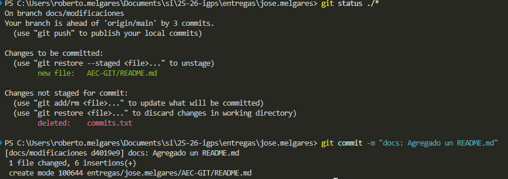
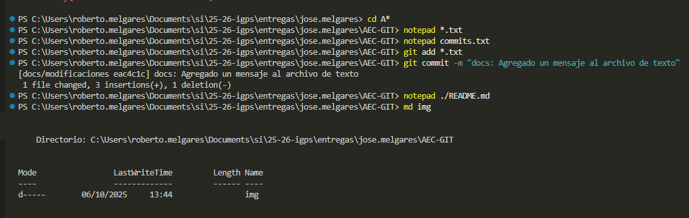

# Este es un README

Este archivo se incluye en otro commit 

### Capturas de pantalla
Abajo está una captura de pantalla del commit que agrega el archivo **commits.txt**.

Ahora tenemos la captura de pantalla del commit que agrega el presente **README.md** y la carpeta de imagenes

