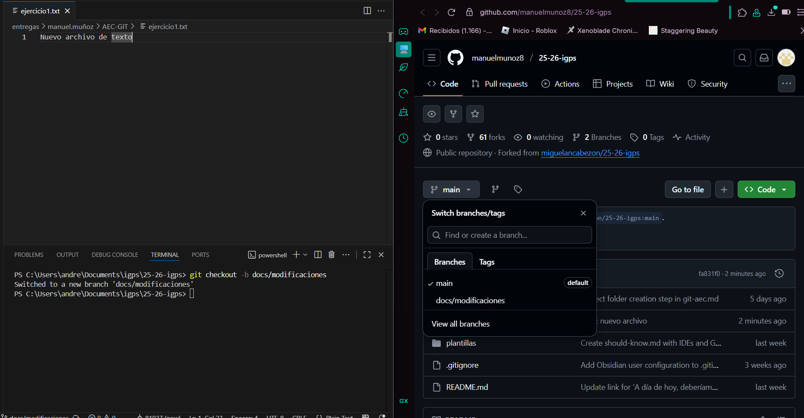
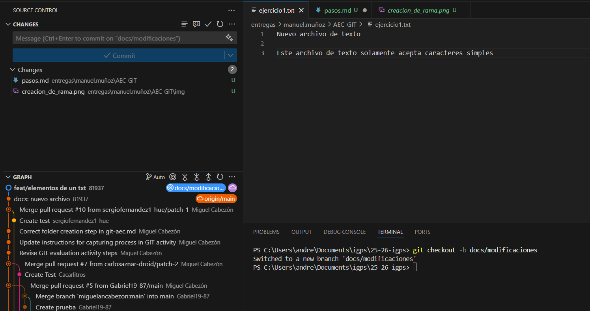
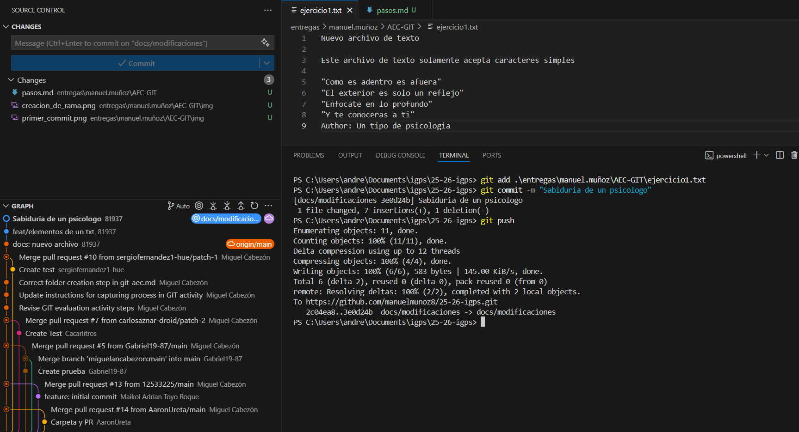
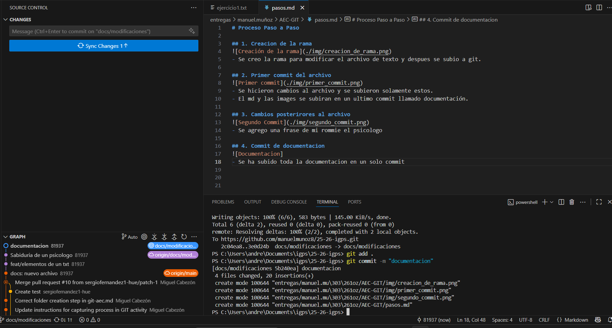

# Proceso Paso a Paso

## 1. Creacion de la rama

- Se creo la rama para modificar el archivo de texto y despues se subio a git.

## 2. Primer commit del archivo

- Se hicieron cambios al archivo y se subieron solamente estos.
- El md y las images se subiran en un ultimo commit llamado documentación.

## 3. Cambios posterirores al archivo

- Se agrego una frase de mi rommie el psicologo

## 4. Commit de documentacion

- Se ha subido toda la documentacion en un solo commit
- posteriormente se ha agregado una ultima imagen para mas aclaracion

